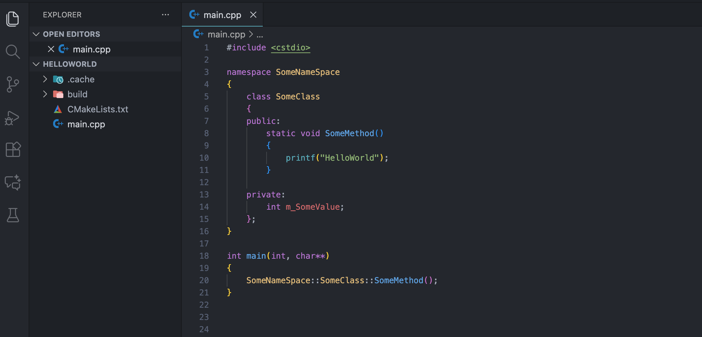

# Atom One Cyan

A Visual Studio Code theme based on the popular Atom One color scheme, enhanced with Cyan accents.

## Design

This theme maintains the familiar syntax highlighting of Atom One but introduces a distinct Cyan tone.

- **Atom One Cyan Dark**: A dark variation with vibrant cyan highlights.
- **Atom One Cyan Light**: A light variation with a modified gray background to reduce glare and eye strain.

## Installation

1. Open the **Extensions** sidebar in VS Code.
2. Search for `Atom One Cyan`.
3. Click **Install**.
4. Select the theme via `Code > Preferences > Color Theme` or `Command Palette > Preferences: Color Theme`.

## Preview

### Dark Theme

### Light Theme

## Feedback

If you find any bugs or have suggestions, please open an issue on [GitHub](https://github.com/keqing996/vscode-atom-one-cyan).

## License

MIT
